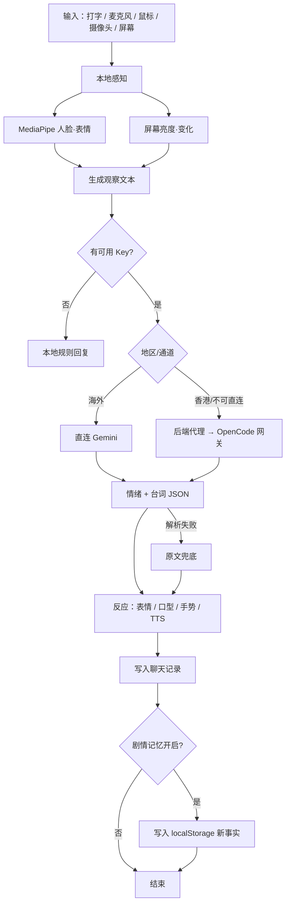
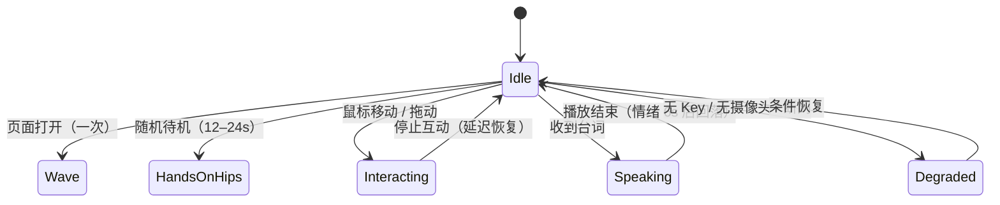
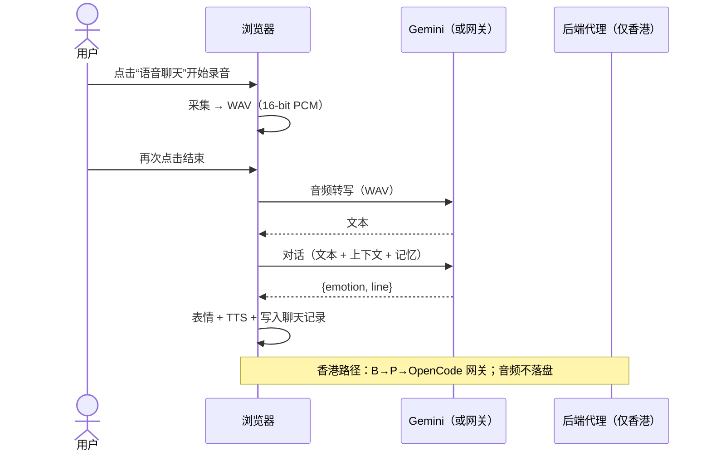
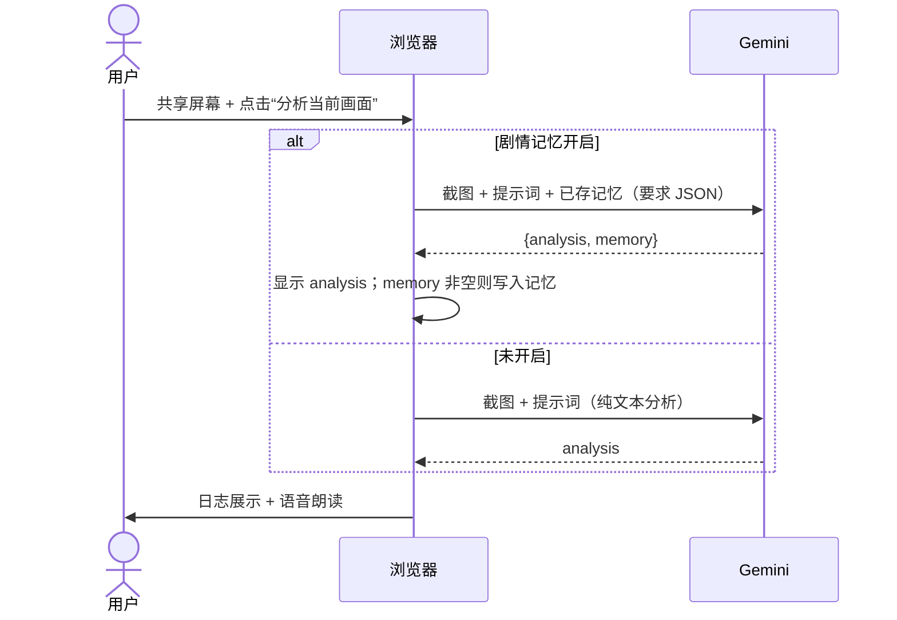
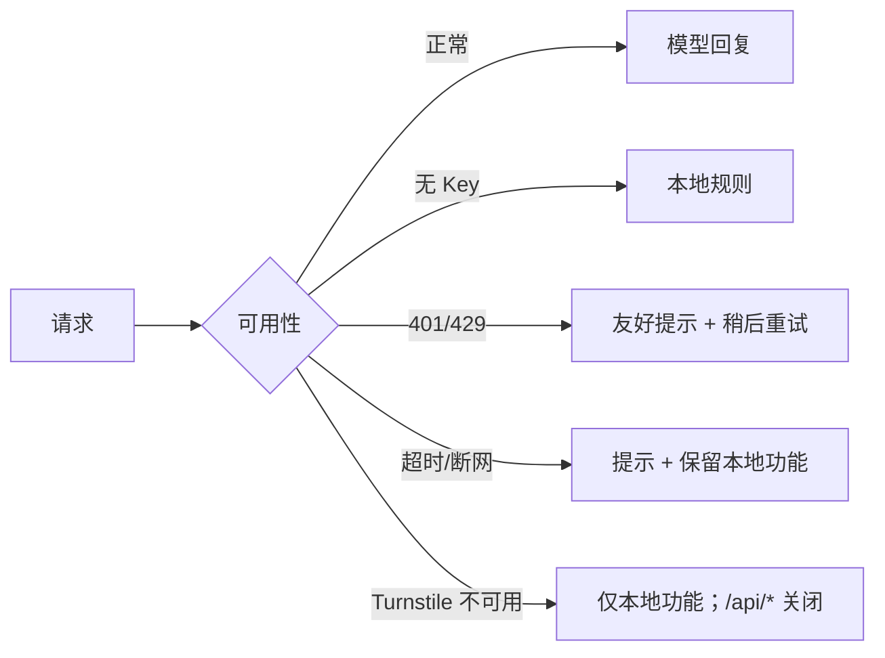

# 流程图（Mermaid）

> 与 `docs/architecture-explainer.html` 配套；GitHub 可直接渲染。  
> 依据 `docs/plan.md` 与 `docs/evidence.md`。

## 1. 反应与对话主流程

```mermaid
flowchart TD
    A[输入：打字 / 麦克风 / 鼠标 / 摄像头 / 屏幕] --> B[本地感知]
    B --> B1[MediaPipe 人脸·表情]
    B --> B2[屏幕亮度·变化]
    B1 --> C[生成观察文本]
    B2 --> C
    C --> D{有可用 Key?}
    D -- 否 --> E[本地规则回复]
    D -- 是 --> F{地区/通道}
    F -- 海外 --> G[直连 Gemini]
    F -- 香港/不可直连 --> H[后端代理 → OpenCode 网关]
    G --> I[情绪 + 台词 JSON]
    H --> I
    I -- 解析失败 --> J[原文兜底]
    I --> K[反应：表情 / 口型 / 手势 / TTS]
    J --> K
    K --> L[写入聊天记录]
    L --> M{剧情记忆开启?}
    M -- 是 --> N[写入 localStorage 新事实]
    M -- 否 --> O[结束]
    N --> O
```

## 2. 角色状态

```mermaid
stateDiagram-v2
    [*] --> Idle
    Idle --> Wave: 页面打开（一次）
    Idle --> HandsOnHips: 随机待机（12–24s）
    Idle --> Interacting: 鼠标移动 / 拖动
    Interacting --> Idle: 停止互动（延迟恢复）
    Idle --> Speaking: 收到台词
    Speaking --> Idle: 播放结束（情绪 6s 后回落）
    Idle --> Degraded: 无 Key / 无摄像头 / 断网
    Degraded --> Idle: 条件恢复
```

## 3. 语音聊天时序

```mermaid
sequenceDiagram
    actor U as 用户
    participant B as 浏览器
    participant G as Gemini（或网关）
    participant P as 后端代理（仅香港）
    U->>B: 点击“语音聊天”开始录音
    B->>B: 采集 → WAV（16-bit PCM）
    U->>B: 再次点击结束
    B->>G: 音频转写（WAV）
    G-->>B: 文本
    B->>G: 对话（文本 + 上下文 + 记忆）
    G-->>B: {emotion, line}
    B->>B: 表情 + TTS + 写入聊天记录
    Note over B,P: 香港路径：B→P→OpenCode 网关；音频不落盘
```

## 4. 屏幕分析（含剧情记忆）

```mermaid
sequenceDiagram
    actor U as 用户
    participant B as 浏览器
    participant M as Gemini
    U->>B: 共享屏幕 + 点击“分析当前画面”
    alt 剧情记忆开启
        B->>M: 截图 + 提示词 + 已存记忆（要求 JSON）
        M-->>B: {analysis, memory}
        B->>B: 显示 analysis；memory 非空则写入记忆
    else 未开启
        B->>M: 截图 + 提示词（纯文本分析）
        M-->>B: analysis
    end
    B->>U: 日志展示 + 语音朗读
```

## 5. 降级路径

```mermaid
flowchart LR
    X[请求] --> Y{可用性}
    Y -- 正常 --> Z[模型回复]
    Y -- 无 Key --> L[本地规则]
    Y -- 401/429 --> R[友好提示 + 稍后重试]
    Y -- 超时/断网 --> T[提示 + 保留本地功能]
    Y -- Turnstile 不可用 --> S[仅本地功能；/api/* 关闭]
```
